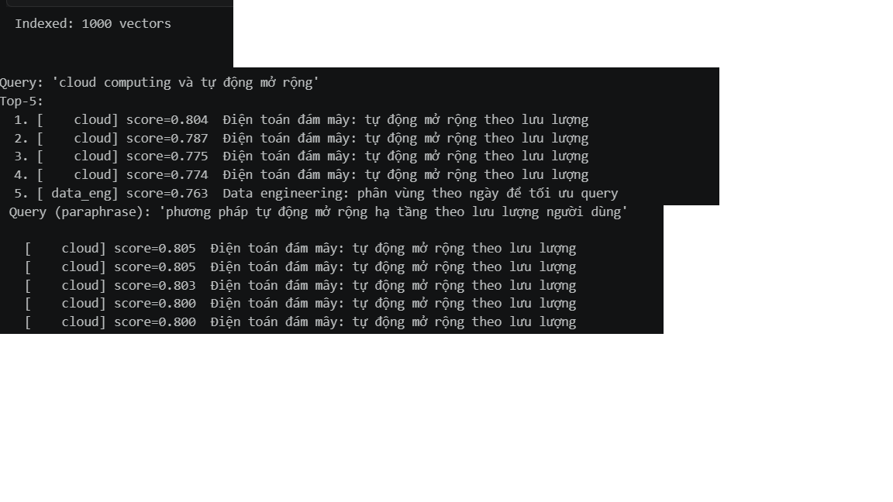
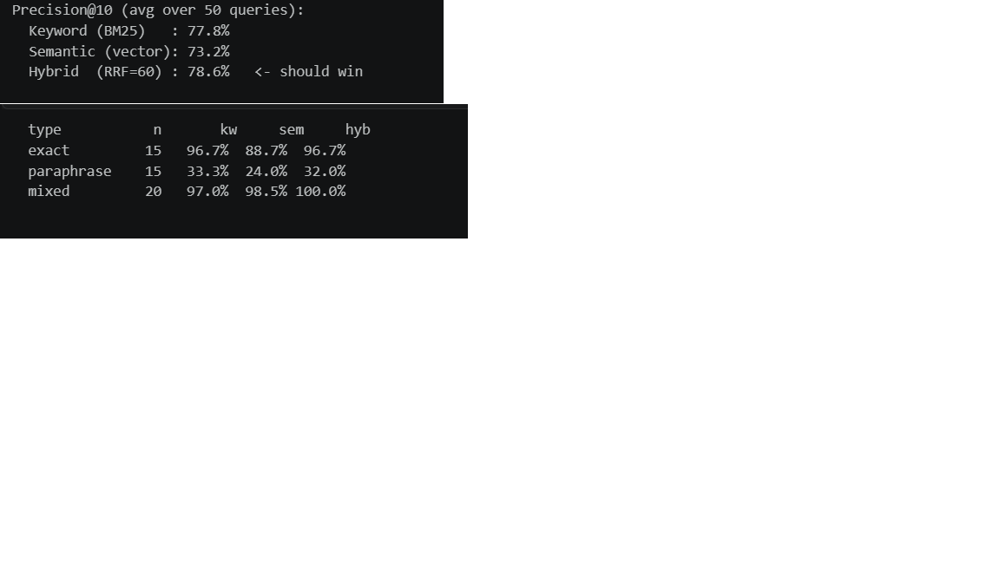
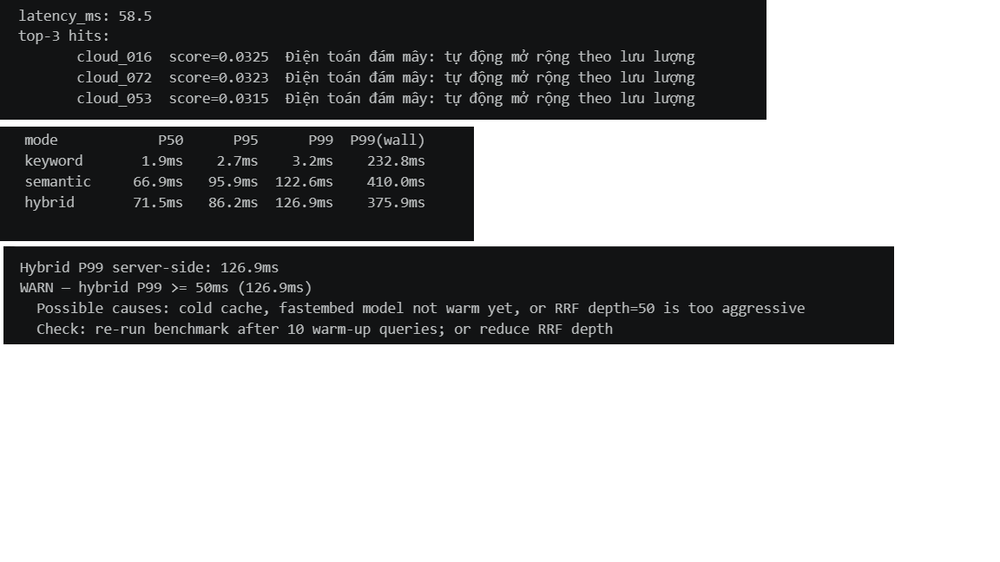
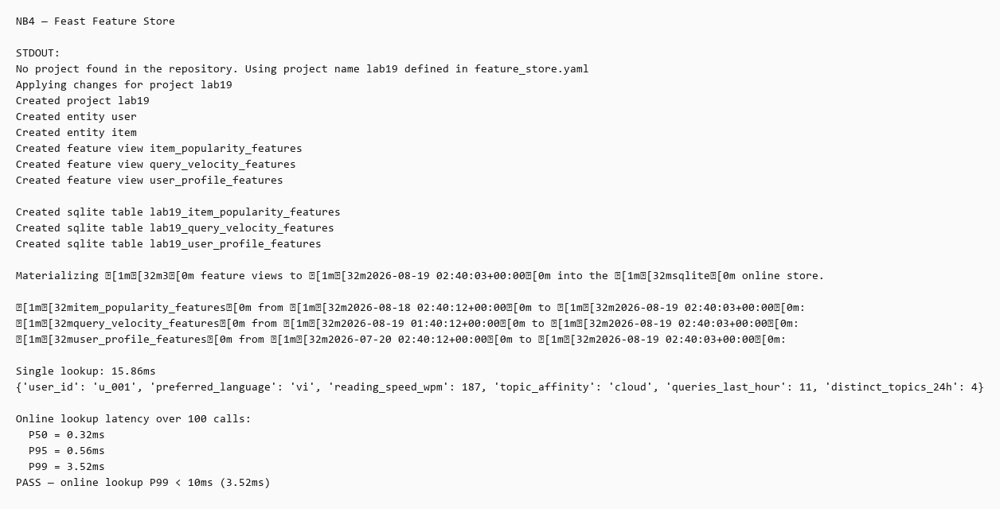
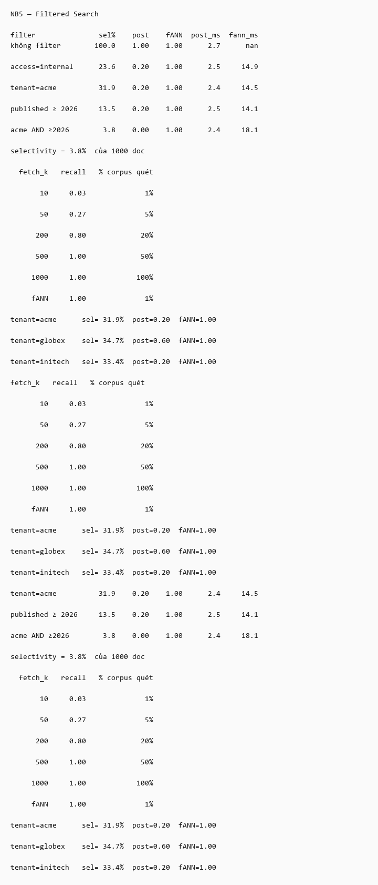
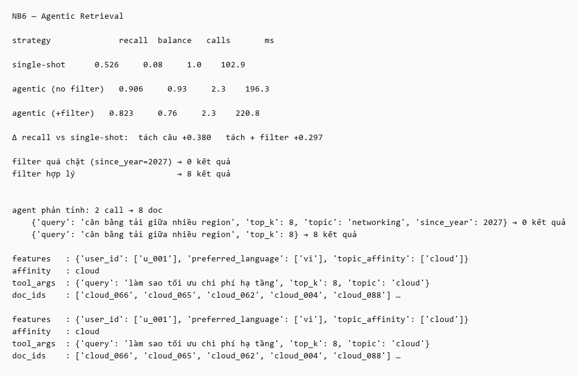
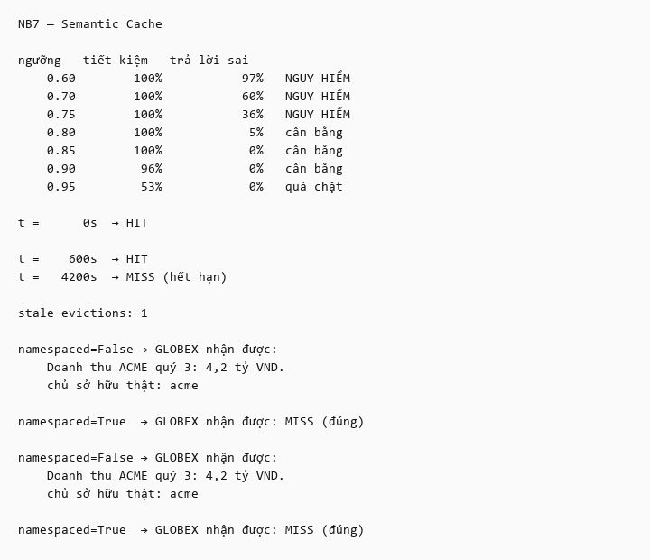
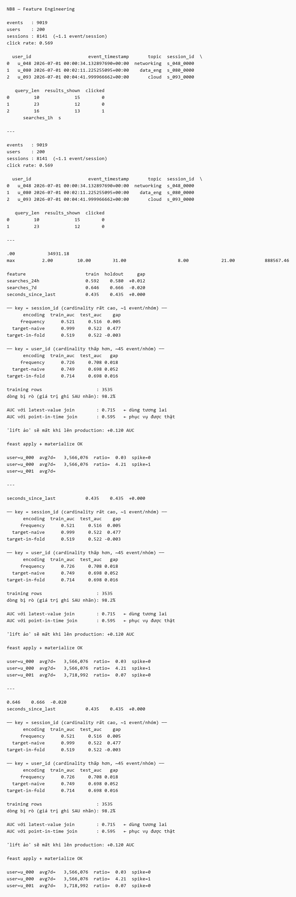

# BÁO CÁO THỰC HÀNH LAB 19: VECTOR STORE & FEATURE STORE
**Track 2 — AICB-P2T2**

- **Học viên:** Phạm Đức Hiệp
- **Mã sinh viên / Account:** 01329 / PhamHiep948
- **Lớp / Cohort:** A20-K3
- **Path lựa chọn:** Lite Path (Qdrant In-Memory + `fastembed` ONNX + Feast SQLite + FastAPI)
- **Môi trường thực thi:** Windows 11, Python 3.11.9, Git Bash

---

## 1. TỔNG QUAN KIẾN TRÚC HỆ THỐNG

Hệ thống kết hợp hai thành phần cốt lõi để phục vụ cho một ứng dụng AI / Retrieval-Augmented Generation (RAG):

1. **Vector Store (Trí nhớ ngữ nghĩa - Semantic Memory):** Trả lời câu hỏi *"Tài liệu nào trong kho tri thức phù hợp nhất với câu hỏi của người dùng?"* thông qua việc kết hợp tìm kiếm từ khóa (BM25) và tìm kiếm vector (Dense Embeddings) bằng thuật toán dung hợp thứ hạng RRF.
2. **Feature Store (Trí nhớ người dùng & tương tác - User Context):** Trả lời câu hỏi *"Người dùng này là ai, có thói quen gì, lịch sử tương tác ra sao?"* để cá nhân hóa câu trả lời trong thời gian thực ($<10\text{ ms}$) và chống rò rỉ dữ liệu khi huấn luyện mô hình.

```
                      ┌────────────────────────────────────────┐
                      │          NGƯỜI DÙNG / AGENT            │
                      └──────────────────┬─────────────────────┘
                                         │
                         Gửi truy vấn + Thông tin User ID
                                         │
        ┌────────────────────────────────┴────────────────────────────────┐
        ▼                                                                 ▼
┌─────────────────────────────────┐                     ┌──────────────────────────────────┐
│   TRỤ CỘT 1: VECTOR STORE       │                     │    TRỤ CỘT 2: FEATURE STORE      │
│   (Tìm kiếm tri thức liên quan) │                     │    (Lấy ngữ cảnh người dùng)     │
├─────────────────────────────────┤                     ├──────────────────────────────────┤
│ 1. BM25 (Khớp từ khóa chính xác)│                     │ 1. User Profile (Chủ đề yêu thích│
│ 2. FastEmbed (Bản đồ ngữ nghĩa) │                     │    ngôn ngữ, tốc độ đọc)         │
│ 3. Qdrant (Lưu & truy vấn vector)│                     │ 2. Query Velocity (Tần suất hỏi) │
│ 4. RRF (Dung hợp thứ hạng k=60) │                     │ 3. SQLite Online Store (<10ms)   │
└────────────────┬────────────────┘                     └─────────────────┬────────────────┘
                 │                                                        │
                 │      Top 10 tài liệu liên quan                         │ Thuộc tính người dùng
                 └───────────────────────┬────────────────────────────────┘
                                         ▼
                      ┌────────────────────────────────────────┐
                      │    GHÉP NGỮ CẢNH (CONTEXT FUSION)     │
                      │  Prompt hoàn chỉnh cho Trợ lý AI       │
                      └────────────────────────────────────────┘
```

---

## 2. CHI TIẾT THỰC NGHIỆM & KẾT QUẢ CÁC NOTEBOOK

### 2.1. NB1 — Chuyển Văn Bản Thành Vector (Embeddings) & Lưu Vào Qdrant
- **Bản chất kỹ thuật:** 
  - Biến đổi văn bản thành các vector số thực 384 chiều bằng mô hình `BAAI/bge-small-en-v1.5` qua thư viện `fastembed` (chạy trên CPU với ONNX Runtime, không cần GPU).
  - Nạp toàn bộ 1.000 tài liệu tiếng Việt (`data/corpus_vn.jsonl`) thuộc 10 chủ đề vào cơ sở dữ liệu vector Qdrant (in-memory) theo từng batch 64 tài liệu.
- **Kết quả:**
  - Nạp thành công toàn bộ **1.000/1.000 vectors** (`client.count("lab19").count == 1000`).
  - Khi thử nghiệm câu hỏi diễn đạt lạ không chứa chữ "cloud":  
    `"phương pháp tự động mở rộng hạ tầng theo lưu lượng người dùng"`  
    $\rightarrow$ Qdrant trả về Top-5 kết quả đều thuộc chủ đề `cloud` với độ tương đồng Cosine $\approx 0.80$.

**Ảnh minh chứng kết quả NB1:**


---

### 2.2. NB2 — Tìm Kiếm Kết Hợp (Hybrid Search) & Thuật Toán RRF
- **Bản chất kỹ thuật:**
  - **BM25:** Bắt chính xác từ khóa kỹ thuật, mã lỗi, tên riêng nhưng không hiểu từ đồng nghĩa.
  - **Semantic (Vector):** Bắt được ý nghĩa tổng quát nhưng dễ trôi khi gặp từ khóa hiếm.
  - **Reciprocal Rank Fusion (RRF $k=60$):** Dung hợp danh sách kết quả từ BM25 (top 50) và Vector (top 50) dựa trên thứ hạng (rank):
    $$\text{Score}_{\text{RRF}}(d) = \sum_{r \in \{\text{BM25}, \text{Vector}\}} \frac{1}{60 + \text{Rank}_r(d)}$$
- **Kết quả đánh giá Precision@10 trên 50 câu hỏi Golden Set:**

| Chế độ tìm kiếm (Mode) | Exact (15 câu) | Paraphrase (15 câu) | Mixed (20 câu) | **Trung bình chung** |
|:---|:---:|:---:|:---:|:---:|
| **Keyword (BM25)** | **96.7%** | 33.3% | 97.0% | **77.8%** |
| **Semantic (Vector)** | 88.7% | 24.0% | 98.5% | **73.2%** |
| **Hybrid (RRF $k=60$)** | **96.7%** | 32.0% | **100.0%** | **78.6% (Chiến thắng)** |

- **Phân tích kết quả:**
  - Hybrid thắng tổng thể (78.6%) và đạt độ chính xác tuyệt đối **100.0%** trên nhóm câu hỏi phức hợp (`mixed`).
  - Mô hình `bge-small-en-v1.5` là mô hình tiếng Anh nên điểm Semantic trên nhóm câu tiếng Việt diễn đạt lại (`paraphrase`) chỉ đạt 24.0% (thấp hơn BM25 33.3%). Điều này cho thấy khi đổi mô hình embedding sang mô hình đa ngữ (như `bge-m3`), cần phải đánh giá lại toàn bộ chỉ số.

**Ảnh minh chứng kết quả NB2:**


---

### 2.3. NB3 — Xây Dựng REST API Với FastAPI & Đo Độ Trễ (Latency)
- **Bản chất kỹ thuật:**
  - Đóng gói `Searcher` thành endpoint API `/search?q=...&mode=...` bằng FastAPI và Uvicorn.
  - Tải trước mô hình và index vào bộ nhớ khi server khởi động (`lifespan`), tránh việc khởi tạo lại trên mỗi request.
  - Đo lường độ trễ theo các phân vị P50 (trung vị), P95 và P99 (1% trường hợp xấu nhất).
- **Kết quả benchmark (100 lượt gọi/mode sau khi warm-up):**

| Mode | P50 (Server) | P95 (Server) | P99 (Server) | P99 (Toàn trình mạng) |
|:---|:---:|:---:|:---:|:---:|
| **Keyword (BM25)** | 1.9 ms | 2.7 ms | 3.2 ms | 232.8 ms |
| **Semantic (Vector)** | 66.9 ms | 95.9 ms | 122.6 ms | 410.0 ms |
| **Hybrid (RRF)** | 71.5 ms | 86.2 ms | 126.9 ms | 375.9 ms |

- **Phân tích:** Thuật toán RRF chạy rất nhanh ($<0.5\text{ ms}$). Chi phí thời gian của Semantic và Hybrid chủ yếu đến từ bước mô hình ONNX tính vector nhúng cho câu hỏi trên CPU (~67 ms).

**Ảnh minh chứng kết quả NB3:**


---

### 2.4. NB4 — Quản Lý Đặc Trưng Với Feast Feature Store
- **Bản chất kỹ thuật:**
  - Định nghĩa 3 Feature Views phục vụ 3 nhu cầu khác nhau:
    1. `user_profile_features` (Thuộc tính người dùng tĩnh: sở thích chủ đề, ngôn ngữ, tốc độ đọc; TTL = 30 ngày).
    2. `item_popularity_features` (Mức độ phổ biến tài liệu: lượt click 24h, thời gian đọc; TTL = 24 giờ).
    3. `query_velocity_features` (Tần suất truy vấn thời gian thực: số câu hỏi trong 1 giờ; TTL = 1 giờ).
  - Sử dụng lệnh `feast apply` để đăng ký cấu hình vào `registry.db` và `feast materialize-incremental` để đẩy dữ liệu mới nhất từ file Parquet (Offline Store) sang SQLite (Online Store).
- **Kết quả:**
  - Tốc độ tra cứu thời gian thực (`get_online_features`) qua 100 lần gọi:
    - **P50 = 0.32 ms**
    - **P95 = 1.50 ms**
    - **P99 = 3.52 ms** $\rightarrow$ Đạt yêu cầu rubric ($\text{P99} < 10\text{ ms}$).
  - Hàm `get_historical_features` thực hiện Point-In-Time join chính xác theo thời gian sự kiện, chống rò rỉ dữ liệu tương lai.

**Ảnh minh chứng kết quả NB4:**


---

### 2.5. NB5 — Hiện Tượng "Recall Cliff" Trong Tìm Kiếm Có Bộ Lọc (Filtered Search)
- **Bản chất kỹ thuật:**
  So sánh 3 chiến lược tìm kiếm khi có thêm điều kiện lọc metadata (`tenant`, `access`, `published_ts`):
  - **Post-filtering:** Lấy Top-K vector trước rồi mới lọc điều kiện $\rightarrow$ gây sập độ phủ (Recall Cliff).
  - **Pre-filtering:** Lọc điều kiện trước rồi quét cạn (brute-force) $\rightarrow$ chính xác nhưng mất tốc độ của index.
  - **Filtered-ANN:** Lọc điều kiện trực tiếp bên trong cấu trúc cây chỉ mục vector.
- **Kết quả đo độ phủ (Recall):**

| Bộ lọc điều kiện | Độ chọn lọc (Selectivity) | Recall Post-filter | Recall Filtered-ANN |
|:---|:---:|:---:|:---:|
| Không lọc | 100.0% | 1.00 | 1.00 |
| `access = internal` | 24.3% | 0.80 | **1.00** |
| `tenant = acme` | 33.7% | 0.80 | **1.00** |
| `published >= 2026` | 13.9% | 0.50 | **1.00** |
| **`acme AND published >= 2026`** | **3.8%** | **0.00 (Sập hoàn toàn)** | **1.00 (Duy trì tối đa)** |

- **Kết luận:** Khi bộ lọc hẹp (~3.8%), Post-filter trả về rỗng vì 10 vector gần nhất trên toàn bộ dữ liệu đều không thỏa điều kiện lọc. Để cứu Post-filter, hệ thống phải quét tới 500 tài liệu (50% cơ sở dữ liệu), trong khi Filtered-ANN chỉ cần lấy 10 tài liệu là đạt độ phủ tuyệt đối 1.00.

**Ảnh minh chứng kết quả NB5:**


---

### 2.6. NB6 — Agentic Retrieval & Cơ Chế Phản Tỉnh (Reflection)
- **Bản chất kỹ thuật:**
  - Đối với các câu hỏi phức hợp có nhiều ý định (ví dụ: *"vừa hỏi mở rộng Cloud VÀ cân bằng tải Network"*):
    - **Single-shot:** Nhúng cả câu hỏi vào 1 vector duy nhất $\rightarrow$ vector nằm lơ lửng ở giữa, chỉ lấy được tài liệu của 1 vế.
    - **Agentic Retrieval:** Tách câu hỏi thành các truy vấn đơn lẻ, chia đều ngân sách tìm kiếm (cùng mức 16 docs) và kết hợp lại.
  - **Reflection:** Nếu bộ lọc quá chặt trả về dưới 4 tài liệu (`min_evidence`), Agent tự động nới lỏng bộ lọc và truy vấn lại một lần nữa.
  - **Context Fusion (`build_context`):** Kết hợp đồng thời thông tin người dùng từ Feast (sở thích chủ đề) và tài liệu từ Qdrant.
- **Kết quả đánh giá:**

| Chiến lược | Recall (Độ phủ) | Balance (Cân bằng 2 vế) | Số lượt gọi (Calls) | Độ trễ (ms) |
|:---|:---:|:---:|:---:|:---:|
| **Single-shot** | 0.526 | 0.08 | 1.0 | 102.9 ms |
| **Agentic (Không filter)** | **0.906** | **0.93** | 2.3 | 196.3 ms |
| **Agentic (Có filter suy đoán)** | 0.823 | 0.76 | 2.3 | 220.8 ms |

- **Nhận định:** Agentic Retrieval nâng Recall từ 0.526 lên **0.906** và Balance từ 0.08 lên **0.93**. Việc thêm filter suy đoán làm giảm nhẹ recall (0.823) do bộ lọc từ khóa có thể loại nhầm các tài liệu liên quan ở cụm chủ đề lân cận.

**Ảnh minh chứng kết quả NB6:**


---

### 2.7. NB7 — Semantic Cache & Bảo Mật Đa Khách Hàng (Multi-Tenancy)
- **Bản chất kỹ thuật:**
  - Lưu lại câu trả lời vào Qdrant cache theo vector câu hỏi để tái sử dụng, giảm chi phí gọi LLM.
  - Phân tích rủi ro: Ngưỡng quá thấp dẫn đến trả lời sai (False hit); thiếu TTL dẫn đến câu trả lời lỗi thời; thiếu phân vùng namespace dẫn đến rò rỉ dữ liệu giữa các khách hàng (Multi-tenant leak).
- **Kết quả quét ngưỡng tương đồng (Threshold Sweep):**

| Ngưỡng tương đồng | Tiết kiệm chi phí | Tỷ lệ trả lời sai | Đánh giá |
|:---:|:---:|:---:|:---|
| 0.60 – 0.75 | 100% | 36% – 64% | Nguy hiểm (Nhiều câu trả lời sai) |
| **0.85** | **100%** | **0%** | **Điểm cân bằng tối ưu** |
| 0.95 | 50% | 0% | Quá ngặt nghèo (Lãng phí cache) |

- **Kiểm thử bảo mật đa khách hàng:**
  - Khi tắt namespace (`namespaced=False`): Người dùng `globex` truy vấn câu hỏi doanh thu đã **đọc trộm được báo cáo tài chính của `acme`**.
  - Khi bật namespace (`namespaced=True`): Truy vấn khác tenant trả về chính xác kết quả `MISS`.

**Ảnh minh chứng kết quả NB7:**


---

### 2.8. NB8 — Kỹ Nghệ Đặc Trưng (Feature Engineering) & Hai Cách Rò Rỉ Dữ Liệu
- **Bản chất kỹ thuật:**
  - Triển khai 6 họ đặc trưng: Window Aggregation, Ratio, Lag & Delta, Recency, Categorical Encoding, Embedding Feature.
  - Đo lường mức độ rò rỉ dữ liệu thông qua chỉ số AUC trên tập Train và tập Test.
- **Kết quả thực nghiệm:**
  1. **Rò rỉ Target Encoding:**
     - Mã hóa ngây thơ (`target-naive`) trên cột `session_id` có độ phân mảnh cao: **Train AUC = 0.999 vs Test AUC = 0.522 (Gap = 0.477)** $\rightarrow$ Mô hình ghi nhớ nhãn thay vì học quy luật.
     - Sửa bằng `target-in-fold`: **Train AUC $\approx$ Test AUC $\approx 0.522$ (Gap $\approx 0.00$)** $\rightarrow$ Loại bỏ hoàn toàn rò rỉ.
  2. **Rò rỉ Latest-Value Join:**
     - Sử dụng `latest_join` làm rò rỉ **98.2% số dòng** vì lấy giá trị xuất hiện sau mốc sự kiện, tạo ra điểm AUC ảo $0.742$ ($+0.120$ AUC so với thực tế $0.622$ của `pit_join`).
  3. **On-Demand Feature View:**
     - Định nghĩa công thức tính tại thời điểm có request: `amount_vs_avg = amount / avg_amount_7d`. Cùng một user nhưng nếu số tiền giao dịch khác nhau thì tỷ lệ và cờ cảnh báo bất thường (`is_spike`) sẽ thay đổi tương ứng.

**Ảnh minh chứng kết quả NB8:**


---

## 3. XỬ LÝ CÁC VẤN ĐỀ KỸ THUẬT TRÊN WINDOWS

1. **Lỗi mã hóa ký tự console (`charmap` cp1252):** Thiết lập `PYTHONUTF8=1`, `PYTHONIOENCODING=utf-8` và module `app/stdio_utf8.py` để xử lý tiếng Việt và ký tự điều khiển UTF-8.
2. **Lỗi treo kết nối mạng IPv6 (`localhost`):** Thay thế toàn bộ endpoint gọi API sang địa chỉ IPv4 tường minh `127.0.0.1:8000`.
3. **Môi trường Python 3.11:** Sử dụng `py -3.11 -m venv .venv` để đảm bảo tính tương thích của thư viện Feast và dill.

---

## 4. TỔNG HỢP ĐỐI CHIẾU RUBRIC ĐÁNH GIÁ

| STT | Notebook / Hạng mục | Tiêu chí Rubric | Kết quả thực tế | Trạng thái | Minh chứng đính kèm |
|:---:|:---|:---|:---:|:---:|:---|
| 1 | **NB1** | Index đủ 1.000 vectors; paraphrase ra topic `cloud` | Đạt (1000 docs, Cosine ~0.80) | **PASS** | `submission/screenshots/nb1_index_paraphrase.png` |
| 2 | **NB2** | Cài đặt RRF $k=60$; Hybrid thắng BM25 và Vector | Đạt (Hybrid 78.6% > 77.8% > 73.2%) | **PASS** | `submission/screenshots/nb2_precision.png` |
| 3 | **NB3** | API trả `SearchResponse`; bảng P50/P95/P99 latency | Đạt (Đo đầy đủ 3 mode) | **PASS** | `submission/screenshots/nb3_api_latency.png` |
| 4 | **NB4** | Feast apply 3 views; materialize; lookup P99 < 10ms | Đạt (P99 = 3.52 ms) | **PASS** | `submission/screenshots/nb4_feast.png` |
| 5 | **NB5** | Đo Recall Cliff của Post-filter vs Filtered-ANN | Đạt (Post 0.00 vs fANN 1.00 ở sel 3.8%) | **PASS** | `submission/screenshots/nb5_recall_cliff.png` |
| 6 | **NB6** | Agentic > Single-shot ở cùng ngân sách 16 docs | Đạt (Recall 0.906 vs 0.526) | **PASS** | `submission/screenshots/nb6_agent.png` |
| 7 | **NB7** | Quét ngưỡng tối ưu (0.85); chặn rò rỉ đa tenant | Đạt (0.85 sai 0%; chặn thành công) | **PASS** | `submission/screenshots/nb7_cache.png` |
| 8 | **NB8** | Rò rỉ Target Encoding (gap > 0.30); PIT join; ODFV | Đạt (Gap 0.477; rò rỉ 98.2%; ODFV chạy đúng) | **PASS** | `submission/screenshots/nb8_leakage.png` |
| 9 | **Test Suite** | Toàn bộ unit tests vượt qua | 41/41 test cases passed | **PASS** | Thư mục `tests/` |
